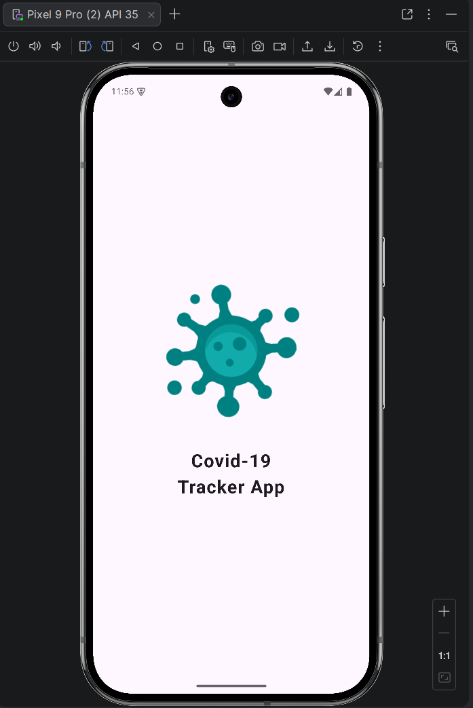
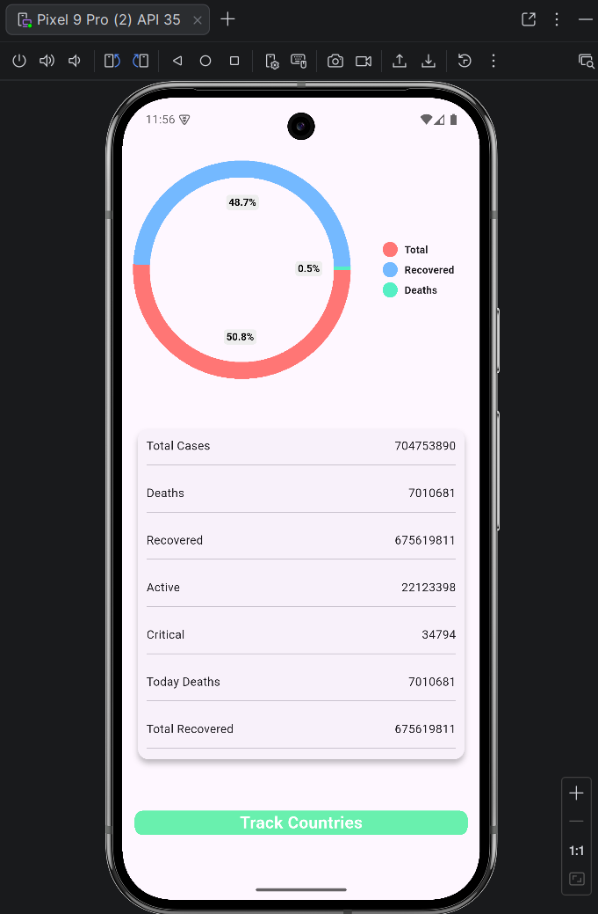
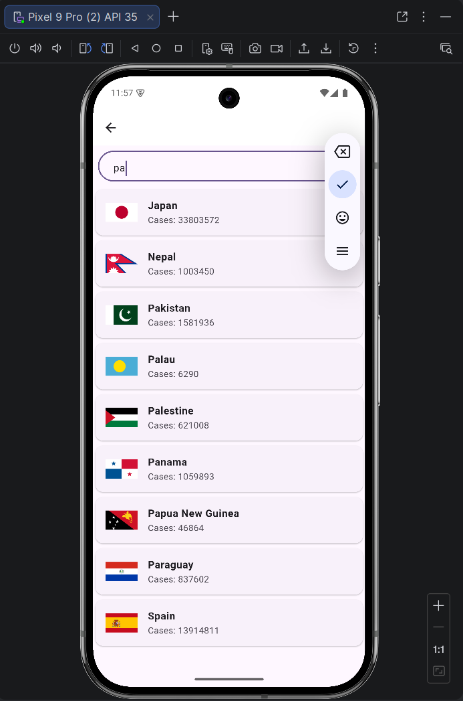
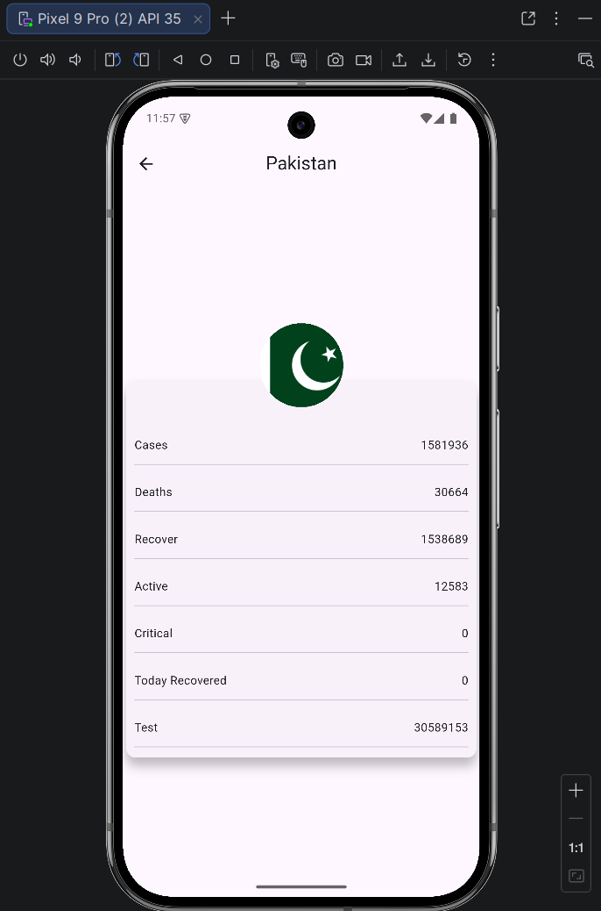

## 🚀 Flutter API Multi-Tab App

A fully functional COVID-19 tracking mobile application built using Flutter.
This project fetches and displays data from multiple endpoints including Users, Quotes, and Posts.

---

## 📱 Features

🔄 Animated Splash Screen (Rotating Logo)

📊 Animated Pie Chart for Global Statistics

🌐 Real-Time Data Fetching from REST API

📋 Country List with Live Search Filtering

🔍 Detailed Country Statistics Screen

🧩 Reusable Components

📱 Clean & Responsive UI

⚡ Optimized Async API Handling

---
## 📸 Screenshots
>/screenshots
├── p1.png
├── p2.png
├── p3.png
└── p4.png

| Splash Screen           | Home Screen             | Search Screen           | Detail Screen           |
|-------------------------|-------------------------|-------------------------|-------------------------|
|  |  |  |  | 


---

## 📂 Project Structure

The project follows a basic layered structure:
```
lib/
│
├── components/
│   └── row_reuse.dart
│
├── models/
│   ├── countries_api.dart
│   └── worldstates.dart
│
├── screens/
│   ├── splash_screen.dart
│   ├── world_states.dart
│   ├── countrieslist_screen.dart
│   └── detail_screen.dart
│
├── services/
│   └── (API service logic)
│
└── main.dart
```

## 🔹 Models

* Generated using JSON-to-Dart plugin to convert API responses into structured Dart classes.

## 🔹 Services

* Contains all API logic inside ApiService, keeping UI clean and maintainable.

## 🔹 Screens

* Responsible only for UI rendering and displaying data.

---

## 🌐 APIs Used

Data is fetched from a public COVID-19 statistics API providing:


Global data:https://disease.sh/v3/covid-19/all

Country-wise statistics:https://disease.sh/v3/covid-19/countries

---

## ⚙️ Technologies Used

🔹 **Flutter**

🔹 **Dart**

🔹 **HTTP package**

🔹 **Pie Chart Package**

🔹 **Shimmer Package**

🔹 **REST APIs**

🔹 **FutureBuilder**

🔹 **JSON parsing**

---

## 🚀 How to Run the Project

1. Clone the repository:

```bash
git clone https://github.com/Dev-Muhammad-Faizan/flutter-covid19-tracker.git
```

2. Navigate to the project directory:

```bash
cd lutter-covid19-tracker
```

3. Install dependencies:

```bash
flutter pub get
```

4. Run the app:

```bash
flutter run
```

---
## 🎯 Learning Outcomes

This project demonstrates:

* Understanding of asynchronous programming in Flutter

* Handling network requests and API responses

* Clean code structure with service-layer separation

* Dynamic UI rendering from remote data

* Search filtering logic

* UI animations & data visualization

* Reusable widget design

---
## 👨‍💻 Author

**Muhammad Faizan**
BS Software Engineering Student
Flutter & Mobile App Development Learner

---

⭐ If you like this project, feel free to star the repository!


